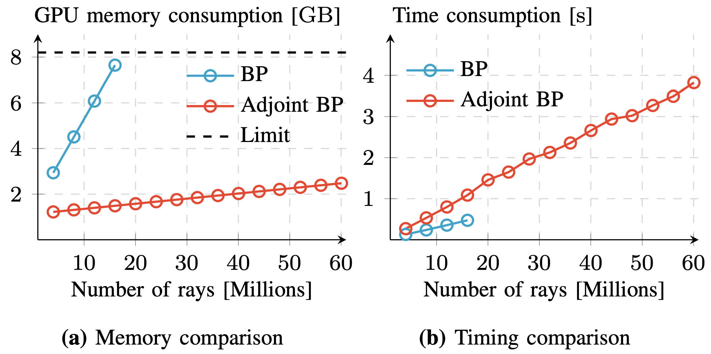
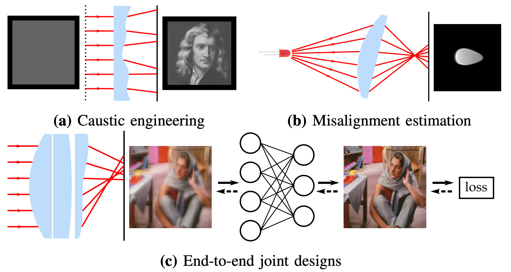

# dO: A differentiable engine for Deep Lens design of computational imaging systems
This is the PyTorch implementation for our paper "dO: A differentiable engine for Deep Lens design of computational imaging systems".
### [Project Page](https://vccimaging.org/Publications/Wang2022DiffOptics/) | [Paper](https://vccimaging.org/Publications/Wang2022DiffOptics/Wang2022DiffOptics.pdf) | [Supplementary Material](https://vccimaging.org/Publications/Wang2022DiffOptics/Wang2022DiffOptics_supp.pdf)

dO: A differentiable engine for Deep Lens design of computational imaging systems  
 [Congli Wang](https://congliwang.github.io),
 [Ni Chen](https://ni-chen.github.io), and
 [Wolfgang Heidrich](https://vccimaging.org/People/heidriw)<br>
King Abdullah University of Science and Technology (KAUST)<br>
IEEE Transactions on Computational Imaging 2022 


Figure: Our engine dO models ray tracing in a lens system in a derivative-aware way, this enables ray tracing with back-propagation. To be derivative-aware, all modules must be differentiable so that gradients can be back-propagated from the error metric ϵ(p(θ)) to variable parameters θ. This is achieved by two stages of the reverse-mode AD: the forward and the backward passes. To ensure differentiability and efficiency, a custom ray-surface intersection solver is introduced. Instead of unrolling iterations for forward/backward, only the forward (no AD) is computed to obtain solutions at surfaces fi = 0, and gradients are amended afterwards.

## TL; DR

We implemented in PyTorch a memory- and computation-efficient differentiable ray tracing system for optical designs, for design applications in freeform, Deep Lens, metrology, and more.

## Update list

- [x] Initial code release.
- [x] [`autodiff.py`](./examples/autodiff.py): Demo illustration of the `dO` engine.
- [x] [`backprop_compare.py`](./examples/backprop_compare.py): Example on comparison between back-propagation and adjoint back-propagation.
- [x] [`caustic_pyramid.py`](./examples/caustic_pyramid.py): Example on freeform caustic design.
- [x] [`misalignment_point.py`](./examples/misalignment_point.py): Example on misalignment back-engineering, using real measurements.
- [x] [`spherical_aberration.py`](./examples/spherical_aberration.py): Example on optimizing spherical aberration.
- [x] [`nikon.py`](./examples/nikon.py): Example on optimizing a Nikon design.
- [ ] [`sanity_check.py`](./examples/sanity_check.py): Example on Zemax versus dO for sanity check.
- [ ] [`end2end_simplelens.py`](./examples/end2end_simplelens.py): Example on end-to-end learning with a simple lens.
- [ ] Code cleanups and comments.
- [ ] File I/O with Zemax.
- [ ] Mini GUI for easy operations.


## Installation

### Prerequisite
Though no GPUs are required, for speed's sake it is better to run the engine on a GPU.

Install the required Python packages:
```python
pip install -r requirements.txt
```

Examples are in the [`./examples`](./examples) folder, and you may need to install additional Python packages when needed, follow the terminal hints.

In case Python cannot find the path to `dO`, run the example scripts in the [`./examples`](./examples) directory, for example:

```shell
cd <directory_of_this_repository>/examples
python3 misalignment_point.py
```


## Summary

### Target problem

- General optical design/metrology or Deep Lens designs are parameter-optimization problems, and learning-based methods (e.g. with back-propagation) can be employed as solvers.  This requires the optical modeling to be numerically derivative-aware (i.e. differentiable).
- However, straightforward differentiable ray tracing with auto-diff (AD) is not memory/computation-efficient.

### Our solutions

- Differentiable ray-surface intersections requires a differentiable root-finding solver, which is typically iterative, like Newton's solver.  Straightforward implementation is inefficient in both memory and computation.  However, our paper makes an observation that, the status of the solver's iterations is *irrelevant* to the final solution -- That means, a differentiable root-finding solver can be smartly implemented as: (1) Find the optimal solution without AD (e.g. in block `with torch.no_grad()` in PyTorch), and (2) Re-engage AD to the solution found.  This leads to great reduce in memory consumption, scaling up the system differentiability to large number of parameters or rays.

|                                   |
| ------------------------------------------------------------ |
| Figure: Comparison between the straightforward and our proposed differentiable ray-surface intersection methods for freeform surface optimization. Our method reduces the required memory by about 6 times. |

- When optimizing a custom merit function for image-based applications appended with a neural network, e.g. in Deep Lens designs, the training (or, back-propagation) can be split into two parts:
  - (Front-end) Optical design parameter optimization (training).
  - (Back-end) Neural network post-processing training.
  
  This de-coupling resembles the checkpointing technology in deep learning, and hence reducing the memory-hunger issue when tracing many number of rays.

|                                           |
| ------------------------------------------------------------ |
|                                   |
| Figure: Adjoint back-propagation (Adjoint BP) and the corresponding comparison against back-propagation (BP).  Our implementation enables the scale up to many millions of rays while the conventional cannot. |

### Applications

|                                  |
| :----------------------------------------------------------: |
| Figure: Using dO the differentiable ray tracing system, we show the feasibility of advanced optical designs. |

## Relevant Project

[Towards self-calibrated lens metrology by differentiable refractive deflectometry](https://vccimaging.org/Publications/Wang2021DiffDeflectometry/Wang2021DiffDeflectometry.pdf)  
 [Congli Wang](https://congliwang.github.io),
 [Ni Chen](https://ni-chen.github.io), and
 [Wolfgang Heidrich](https://vccimaging.org/People/heidriw)<br>
King Abdullah University of Science and Technology (KAUST)<br>
OSA Optics Express 2021

GitHub: https://github.com/vccimaging/DiffDeflectometry.

## Citation

```bibtex
@article{wang2022dO,
  title={{dO: A differentiable engine for Deep Lens design of computational imaging systems}},
  author={Wang, Congli and Chen, Ni and Heidrich, Wolfgang},
  journal={IEEE Transactions on Computational Imaging},
  year={2022},
  volume={8},
  number={},
  pages={905-916},
  doi={10.1109/TCI.2022.3212837}},
  publisher={IEEE}
}
```

## Contact
Please either open an issue, or contact Congli Wang <congli.wang@kaust.edu.sa> for questions.

